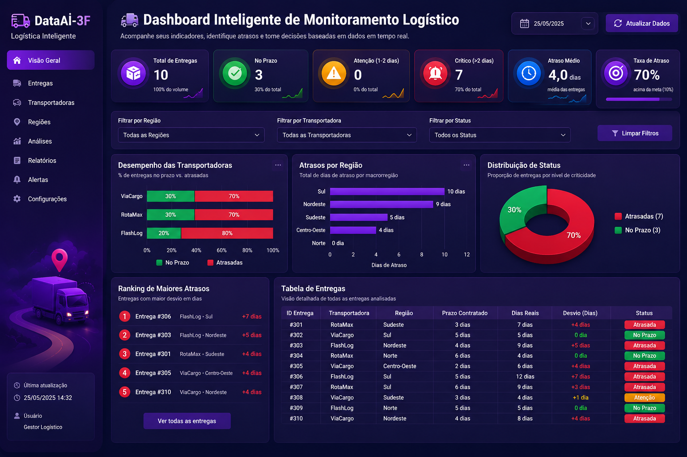

# 🚚 Dashboard Inteligente de Monitoramento Logístico

## Desafio dos Dados – Visualização de Dados (AMT01)

Este projeto foi desenvolvido com o objetivo de demonstrar a construção de um **dashboard inteligente para monitoramento de entregas logísticas**, permitindo acompanhar atrasos, identificar regiões críticas, comparar transportadoras e apoiar a tomada de decisão baseada em dados.

---

# 📌 Informações da Equipe

**Nome da Equipe:**
*DataAI-3F*

**Integrantes:**
* Ana Carolina
* Geovanna Lopes
* Maria CLara
* Julio Cesar

---
## 📸 Print do Dashboard




# 🎯 Objetivo

Desenvolver uma solução capaz de transformar uma base de dados simplificada de entregas em um painel visual que facilite a análise operacional da empresa.

O dashboard permite identificar rapidamente:

* entregas atrasadas;
* transportadoras com maior índice de atraso;
* regiões mais críticas;
* entregas que necessitam de atenção imediata;
* indicadores estratégicos para apoio à gestão.

---

# 🛠 Tecnologias Utilizadas

Este projeto foi desenvolvido utilizando tecnologias Web, permitindo execução diretamente no navegador.

* HTML5
* CSS3
* JavaScript (ES6)
* Chart.js
* GitHub Pages (Hospedagem)

---

# 📊 Funcionalidades Implementadas

## Indicadores principais

* Total de entregas
* Total de entregas atrasadas
* Taxa de atraso
* Maior atraso registrado

---

## Visualizações

* Comparação entre transportadoras
* Comparação por região
* Distribuição das entregas
* Ranking das entregas mais críticas
* Tabela operacional completa

---

## Recursos interativos

* Filtro por região
* Filtro por transportadora
* Campo de busca rápida
* Insights automáticos
* Modais explicativos
* Atualização dinâmica dos gráficos

---

# 🚦 Critério de Priorização

Para facilitar a interpretação dos gestores, foi adotada uma classificação baseada em níveis de criticidade semelhante à lógica utilizada em semáforos e sistemas de monitoramento corporativo.

| Atraso         | Status      |
| -------------- | ----------- |
| 0 dias         | 🟢 No prazo |
| 1 a 2 dias     | 🟡 Atenção  |
| 3 dias ou mais | 🔴 Crítico  |

Essa estratégia permite identificar rapidamente quais entregas exigem ação imediata.

---

# 🧮 Lógica Utilizada

Para cada entrega é calculado o atraso utilizando:

```
Atraso = Dias Reais - Prazo
```

Quando o resultado é negativo, considera-se:

```
Atraso = 0
```

Ou seja, entregas realizadas antes ou exatamente no prazo não geram atraso.

---

# 📈 Organização das Informações

As entregas são apresentadas em ordem decrescente de atraso, permitindo que os maiores problemas operacionais apareçam primeiro.

Os gráficos consolidam os atrasos por:

* região;
* transportadora;
* status operacional;
* ranking de entregas críticas.

---

# 💡 Processo de Construção

O desenvolvimento foi dividido em etapas:

1. Estruturação da base de dados;
2. Implementação dos cálculos de atraso;
3. Construção dos indicadores principais;
4. Desenvolvimento de filtros inteligentes e mecanismo de busca dinâmica, permitindo pesquisas por ID, cidade, região ou transportadora, sem diferenciação entre letras maiúsculas/minúsculas e com tratamento automático de acentuação.
5. Geração dos gráficos interativos;
6. Criação dos insights automáticos;
7. Organização visual do dashboard.

Todo o projeto foi pensado para facilitar a interpretação rápida dos dados por gestores e apoiar decisões operacionais.

---

# 🔗 Link do Dashboard

**Acesso ao dashboard:**

https://dataai-3f.github.io/dashboard-elaborado/
 

# 📚 Observação

Este projeto possui finalidade exclusivamente educacional, utilizando uma base simplificada para demonstrar conceitos de visualização de dados, Business Intelligence e construção de dashboards analíticos.

